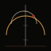

<div align="center">

# DUST<span style="color:#D89A48">//</span>SIGNAL

### Probability has a pulse.

[](https://nextjs.org/)
[](https://www.typescriptlang.org/)
[](https://threejs.org/)
[](https://greensock.com/)
[](https://tailwindcss.com/)
[](https://vitest.dev/)
[](https://playwright.dev/)
[](LICENSE)

<p align="center">
  <em>A computational observatory studying motion, uncertainty, and rhythm.</em>
</p>

<p align="center">
  <strong>V2 — Cinematic WebGL and production hardening</strong>
</p>

</div>

---

## V2 Overview

This is the definitive V2 release of DUST//SIGNAL. Building on the V1 foundation, V2 closes the gap between concept and implementation through:

- **Genuine WebGL hero scene** with custom GLSL shaders (procedural terrain, resonance instrument, celestial body, instanced dust field)
- **GSAP cinematic choreography** with ScrollTrigger-driven camera transitions and a 10-beat opening timeline
- **Single shared canvas** architecture — one WebGL world across the homepage, not two duplicate scenes
- **Six archive experiments with dedicated routes** (`/archive/[slug]`) — each with real experiment-specific controls
- **Seeded sequencer** with strict pattern validation and a proper mobile 2-bank mode
- **Restored production safety** — strict TypeScript, React Strict Mode, restored ESLint rules
- **Reduced dependency count** from 80+ packages to 8 production dependencies
- **Automated test coverage** with Vitest unit tests (51 passing) and Playwright E2E tests

---

## Live Deployment

The production deployment lives at:

**https://dune-aditya.vercel.app**

---

## Route List

| Route | Code | Title | Description |
|-------|------|-------|-------------|
| `/` | 00 | **The Observatory** | WebGL procedural landscape, hero, four forces, Monte Carlo chamber, rhythm architecture, archive preview, final horizon. Single shared canvas. |
| `/models` | 01 | **Mathematical Fields** | Four interactive models with keyboard-navigable tabs and URL state. |
| `/signal` | 02 | **Audio-Visual Sequencer** | 16-step / 4-channel seeded sequencer with mobile 2-bank mode and strict pattern validation. |
| `/archive` | 03 | **Experiments** | Six experiments, each linking to its own dedicated route. |
| `/protocol` | 04 | **Philosophy and Method** | Editorial statement and nine principles. |

## Archive Detail Routes

Every archive experiment has its own shareable URL with real interactive controls:

| Route | Experiment | Key Controls |
|-------|------------|--------------|
| `/archive/volatility-field` | Volatility Field | base variance, skew, curvature, time, strike, mesh density, wireframe/surface toggle, cross-section |
| `/archive/covariance-body` | Covariance Body | node count, threshold, positive/negative force, damping, spatial/matrix view, regenerate, pause |
| `/archive/fourier-room` | Fourier Room | per-component frequency, amplitude, phase, individual/combined/circular/spatial visibility |
| `/archive/brownian-choir` | Brownian Choir | paths, drift, volatility, time horizon, initial value, playback speed, path persistence |
| `/archive/phase-architecture` | Phase Architecture | horizontal/vertical frequency, phase, amplitude, trail length, rotation speed, line/points mode |
| `/archive/liquidity-horizon` | Liquidity Horizon | event count, bandwidth, time window, clustering, decay, ridgelines |

Each archive route includes: experiment number, title, hypothesis, mathematical basis, formula, full visual system, real experiment-specific controls, seed, regenerate action, copy-link action, plain-language explanation, synthetic-data disclaimer, and links to previous/next experiment.

---

## WebGL Architecture

The V2 hero is genuine WebGL on capable devices, with Canvas 2D retained as a fallback.

### Primary scene — `webgl-observatory-scene.tsx`

The scene is broken into focused components:

- `ProceduralTerrain` — subdivided plane with custom vertex shader combining three noise octaves for displacement, height-mapped fragment shader, depth fog, eclipse-reactive lighting.
- `ResonanceInstrument` — original architectural structure built from primitive geometry: two offset vertical masses, suspended rotating measurement rings, ground-level resonance aperture, custom shader with vertical light channel and horizontal calibration cuts.
- `CelestialBody` — distant disc with moving eclipse mask, controlled corona, atmospheric scattering.
- `DustField` — instanced points at varying depths, seeded RNG placement, pointer-reactive, additive blending.
- `ObservatoryCamera` — authored camera states driven by `mode` prop (hero/midpoint/far), restrained parallax (not free OrbitControls), lerp-based smooth movement.
- `SceneLighting` — slowly changing directional + ambient + hemisphere, eclipse-reactive intensity.

### Custom GLSL shaders — `observatory-shaders.ts`

- `terrainVertexShader` / `terrainFragmentShader` — simplex noise, height-mapped color, eclipse-aware lighting, depth fog.
- `instrumentVertexShader` / `instrumentFragmentShader` — vertical channel pulse, calibration lines, eclipse dimming.
- `celestialVertexShader` / `celestialFragmentShader` — disc + corona + eclipse shadow mask.
- `dustVertexShader` / `dustFragmentShader` — depth-varying particle size, pointer influence, soft circular alpha.

### Single shared canvas — Brief §6

The homepage mounts one fixed-position WebGL canvas that persists across all home sections. Scene state (`mode`, `pulse`, `scrollProgress`) is controlled via React state and GSAP scroll progress. DOM content layers above it. The Final Horizon section reuses the same canvas (with `mode="far"`) rather than mounting a duplicate scene.

### Canvas 2D fallback — Brief §20

The Canvas 2D `ObservatoryScene` is retained as:
- WebGL-unavailable fallback (detected via try/catch on `getContext`)
- Reduced-quality fallback where appropriate
- Static reduced-motion composition

---

## GSAP Choreography

GSAP is registered with `ScrollTrigger` and cleaned up via `gsap.context().revert()` on unmount.

### Opening timeline — `useHomeSceneController`

A 10-beat sequence runs on first mount:

1. Black overlay fades out (camera exposure rises)
2. `OBSERVATORY / 00` label appears
3. `PROBABILITY` reveals through vertical mask
4. `HAS A PULSE.` follows one beat later
5. Supporting copy resolves
6. CTAs become interactive

### Scroll sequence

A `ScrollTrigger` with `scrub: 1` drives `scrollProgress` (0..1) and transitions the scene mode:
- 0–0.4 → `hero` (low camera, instrument looming)
- 0.4–0.85 → `midpoint` (camera moves forward and downward)
- 0.85–1.0 → `far` (distant camera, smaller instrument, near-complete eclipse)

### Field statement + section reveals

Each `[data-field-line]` reveals based on viewport position via individual `ScrollTrigger`s. `[data-section-reveal]` elements fade in as they enter the viewport.

### Reduced motion

The controller checks `prefers-reduced-motion` and short-circuits to `introComplete: true` immediately, with no GSAP timelines created.

---

## Mathematical Systems

Every equation is real and wired to live visualisations.

| System | Formula | Where Used |
|--------|---------|------------|
| **Geometric Brownian Motion** | `dS = μSdt + σSdW` | Monte Carlo chamber, models/01, archive/brownian-choir |
| **Volatility Surface (SVI-style)** | `σ²(k,τ) = a + b·{ρk + √(k²+σ_sl²)}` | models/02, archive/volatility-field |
| **Covariance (PSD construction)** | `ρ_ij = C_ij / (σ_i · σ_j)` | models/03, archive/covariance-body |
| **Fourier composition** | `f(t) = Σ Aₙ · sin(2π fₙ t + φₙ)` | models/04, archive/fourier-room |
| **Lissajous figures** | `x = sin(2π f₁ t + φ), y = sin(2π f₂ t)` | archive/phase-architecture |
| **Procedural terrain (FBM)** | Layered simplex noise octaves | WebGL terrain shader |
| **Kernel density estimation** | `f̂(t) = (1/nh) Σ K((t − tᵢ)/h)` | archive/liquidity-horizon |

---

## Audio System

Sound is original, procedural, and generated live by the Web Audio API. **No samples. No commercial audio.**

### Four synthesis voices

| Channel | Synthesis | Role |
|---------|-----------|------|
| **PULSE** | Sine sweep 110 Hz → 45 Hz with fast exponential decay | Low synthetic kick — deforms the landscape |
| **GRAIN** | Short noise burst through bandpass filter (Q=6, 2.4 kHz) | Muted click — emits particles |
| **AIR** | Highpass-filtered noise sweeping 4.5 kHz → 1.2 kHz | Atmospheric texture — changes fog density |
| **SUB** | Triangle wave 49 Hz → 42 Hz with slow swell | Deep atmospheric tone — moves the horizon |

### Safety

- Master gain passes through `DynamicsCompressorNode` limiter (threshold −8 dB, ratio 12:1)
- No clipping, no unexpected loudness
- Default volume 0.6, mute persists for the session
- Audio **disabled by default** — no autoplay anywhere
- Tab-inactive pause

### Seeded pattern generation

Patterns are produced by `generateSeededPattern(seed, density)` using `mulberry32`. A given seed always recreates the same pattern. The visible pattern seed, copied pattern string, and regenerated pattern all refer to the same underlying state.

### Pattern serialization

Pattern format: `bpm|swing|density|pulsebits|grainbits|airbits|subbits`

- bpm: hex
- swing: hex 00–64 (0–100, divided by 100)
- density: hex 00–64 (0–100, divided by 100)
- *bits: exactly 16 binary digits (0 or 1)

The `parsePattern` function strictly validates:
- Input length (max 200 chars)
- Character set (hex, `|`, `0`, `1` only)
- Segment count (exactly 7)
- BPM range (60–200)
- Swing range (0–100)
- Density range (0–100)
- Each channel must be exactly 16 binary digits

Invalid input produces a clear inline error message (`INVALID SEED`). No silent clamping. Save/load operations produce feedback (`PATTERN SAVED`, `PATTERN LOADED`, `NO SAVED PATTERN`).

---

## Adaptive-Quality System

| Profile | DPR | Terrain segments | Dust count | When |
|---------|-----|------------------|------------|------|
| **High** | 1–2 | 256 | 1500 | 8+ cores, 8+ GB memory |
| **Balanced** | 1–1.5 | 128 | 800 | Default desktop |
| **Reduced** | 1 | 64 | 300 | Mobile, ≤4 cores, ≤2 GB, or reduced-motion |

Quality is resolved via `detectDevice()` which checks `navigator.hardwareConcurrency`, `navigator.deviceMemory`, mobile breakpoint, and `prefers-reduced-motion`. The user can override via the system-status control.

### Performance techniques

- IntersectionObserver pauses off-screen canvases (`frameloop="demand"`)
- Tab visibility pauses audio scheduler
- Geometry and materials disposed on unmount
- Seeded RNG — no `Math.random()` in render loops or pattern generation
- Dynamic imports for heavy WebGL scenes (`ssr: false`)
- Instanced dust particles (single draw call)
- Memoised math computations

---

## Accessibility

- **Skip-to-content link** at the top of every page
- Semantic HTML5 landmarks throughout
- Correct heading hierarchy (single `h1` per page)
- Visible keyboard focus rings
- Keyboard-operable model tabs (Arrow Left/Right, Home, End)
- Keyboard-operable sequencer (Tab to step, Enter/Space to toggle)
- Proper slider names and values
- Accessible experiment descriptions
- Modal/focused-mode focus trapping
- Focus restoration on close
- Escape support on mobile menu and modals
- Audio off by default, persistent mute control
- Reduced-motion mode respected throughout
- No flashing content
- Touch-accessible targets (minimum 44px on mobile sequencer)
- Canvas alternatives: decorative canvas uses `aria-hidden="true"`; informative canvas has nearby textual summary

---

## Test Commands

```bash
# Lint
bun run lint

# Type-check (strict, no ignored errors)
bun run typecheck

# Unit tests (Vitest)
bun run test

# Watch mode
bun run test:watch

# End-to-end tests (Playwright)
bun run test:e2e

# Full verification
bun run verify
```

### Actual test results

- **Lint**: 0 errors, 21 warnings (acceptable — React 19 strict-mode rule warnings on common patterns like route-change menu close)
- **Type-check**: passes with strict mode and `noImplicitAny: true`
- **Unit tests**: 51 / 51 passing
  - `seeded-random.test.ts` (10 tests) — mulberry32 determinism, gaussian sanity, hashSeed consistency, formatSeed formatting
  - `math.test.ts` (18 tests) — GBM determinism and statistics, vol surface validation, covariance PSD construction and correlation range, Fourier composition, Lissajous generation, quantile
  - `pattern-serializer.test.ts` (16 tests) — serialize/parse round-trip, validation errors for invalid characters/length/segments/ranges/channels, seeded pattern generation determinism
  - `site-url.test.ts` (7 tests) — URL resolution order, trailing slash normalization, production domain verification
- **Production build**: passes, all 15 routes generated (5 static + 6 SSG archive + OG image + sitemap + robots)

---

## Dependency Cleanup Result

V2 removes 70+ unused packages from V1.

### Removed

Prisma, `@prisma/client`, NextAuth, all DnD Kit packages, MDX Editor, TanStack Table, TanStack Query, React Day Picker, React Hook Form, `@hookform/resolvers`, Recharts, Embla Carousel, React Markdown, React Syntax Highlighter, Resizable Panels, OTP input, `next-intl`, `next-themes`, `z-ai-web-dev-sdk`, Framer Motion, Zustand, UUID, `class-variance-authority`, `clsx`, `tailwind-merge`, `cmdk`, `vaul`, `sonner`, `date-fns`, `lucide-react`, `@reactuses/core`, all unused Radix UI packages, the entire `src/components/ui/` shadcn scaffold, the Prisma schema, the database, the placeholder `/api` route.

### Remaining production dependencies (8)

`@react-three/drei`, `@react-three/fiber`, `gsap`, `lenis`, `next`, `react`, `react-dom`, `three`

### Install size

533 packages total (down from 1000+ in V1).

---

## Build

```bash
bun install
bun run build
```

Output is a standalone Next.js bundle in `.next/standalone/`. The build:
- Compiles with TypeScript strict mode
- Validates ESLint (no ignored errors)
- Generates static pages for all routes
- Pre-renders 6 archive detail routes via `generateStaticParams`
- Generates the OG image dynamically via `opengraph-image.tsx` (using `ImageResponse`)
- Emits `sitemap.xml` and `robots.txt`

---

## Vercel Deployment

1. Push this branch to GitHub
2. Import the repo at [vercel.com/new](https://vercel.com/new)
3. Vercel auto-detects Next.js — no configuration needed
4. Set `NEXT_PUBLIC_SITE_URL` to the production URL (optional — auto-detected via `VERCEL_PROJECT_PRODUCTION_URL`)
5. Deploy

The production domain is `https://dune-aditya.vercel.app`.

---

## Security Headers

The Next.js config emits the following headers on all routes:

- `X-Content-Type-Options: nosniff`
- `Referrer-Policy: strict-origin-when-cross-origin`
- `Permissions-Policy: camera=(), microphone=(), geolocation=(), browsing-topics=(), interest-cohort=()`
- `X-Frame-Options: DENY`
- `X-DNS-Prefetch-Control: on`

HSTS is handled by Vercel automatically.

---

## Intellectual Property Statement

> DUST//SIGNAL is an original experimental project. It does not contain or represent any official film property, character, world, soundtrack, or brand.

All visual assets, code, sound synthesis, copy, GLSL shaders, and the emblem are original work. The project draws on influences — monumental desert science-fiction cinema, brutalist architecture, underground house music, scientific instrumentation — but does not reproduce any protected creative element.

No Dune logos, names, characters, planets, symbols, costumes, vehicles, terminology, dialogue, soundtrack, posters, stills, or promotional assets are used.

---

## Browser Support

| Browser | Status |
|---------|--------|
| Chrome / Edge (Chromium 110+) | Fully supported |
| Firefox (110+) | Fully supported |
| Safari (16+) | Fully supported |
| Mobile Chrome / Safari | Supported with reduced quality, 2-bank sequencer mode |
| Browsers without WebGL2 | Automatic Canvas 2D fallback with SVG composition |

---

## Credits

DUST//SIGNAL V2 is built on the work of many open-source projects:

| Project | Role |
|---------|------|
| [Next.js 16](https://nextjs.org/) | React framework, App Router, RSC, ImageResponse OG |
| [React 19](https://react.dev/) | UI library, Strict Mode |
| [Three.js](https://threejs.org/) | WebGL abstraction |
| [@react-three/fiber](https://github.com/pmndrs/react-three-fiber) | React renderer for Three.js |
| [@react-three/drei](https://github.com/pmndrs/drei) | Useful helpers for R3F |
| [GSAP + ScrollTrigger](https://greensock.com/) | Cinematic animation, scroll choreography |
| [Lenis](https://github.com/studio-freight/lenis) | Smooth scroll |
| [Tailwind CSS 4](https://tailwindcss.com/) | Utility-first styling |
| [IBM Plex Mono](https://fonts.google.com/specimen/IBM+Plex+Mono) | Technical / data typeface |
| [Space Grotesk](https://fonts.google.com/specimen/Space+Grotesk) | Display typeface |
| [Instrument Serif](https://fonts.google.com/specimen/Instrument+Serif) | Editorial contrast typeface |
| [Vitest](https://vitest.dev/) | Unit testing |
| [Playwright](https://playwright.dev/) | End-to-end testing |

---

## License

MIT License. See [LICENSE](LICENSE) for full text.

---

<div align="center">

<p align="center">
  
</p>

<p align="center">
  <em>The field remains open.</em>
</p>

<p align="center">
  <code>FIELD v2.0 · BUILD 2026 · ORIGINAL EXPERIMENTAL PROJECT</code>
</p>

</div>
