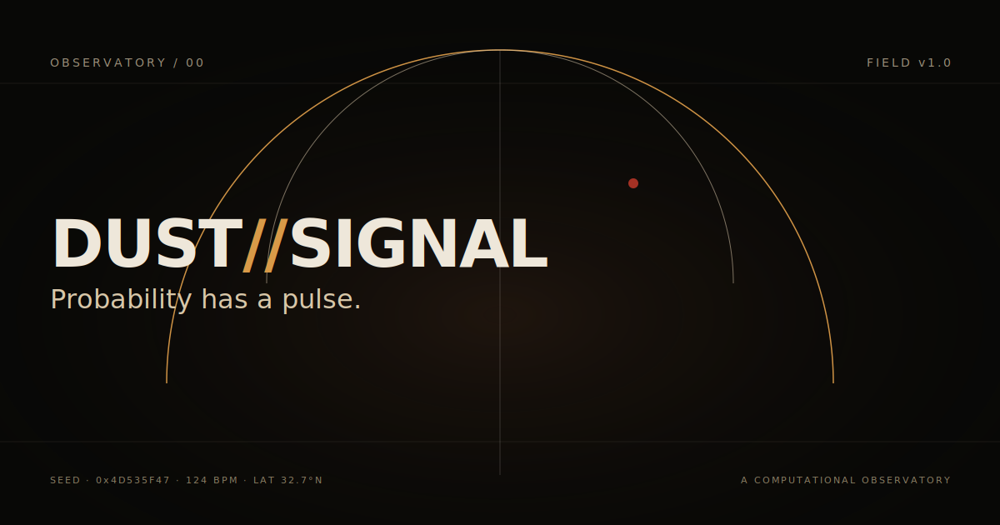

<div align="center">

# DUST<span style="color:#D89A48">//</span>SIGNAL

### Probability has a pulse.

[](https://nextjs.org/)
[](https://www.typescriptlang.org/)
[](https://threejs.org/)
[](https://greensock.com/)
[](https://tailwindcss.com/)
[](LICENSE)

<p align="center">
  <em>A computational observatory studying motion, uncertainty, and rhythm.</em>
</p>

<p align="center">
  
</p>

</div>

---

## Concept

**DUST//SIGNAL** is an original, cinematic, interactive digital artwork — a fictional experimental research studio exploring the point where quantitative mathematics, electronic sound, physical systems, architecture, light, and human perception meet. The experience is built to feel like entering an unfamiliar computational civilization inside an immense desert observatory.

The project is built around three core ideas:

| Idea | Description |
|------|-------------|
| **Mathematics creates structure** | The visual system is generated through probability, vectors, oscillation, stochastic motion, matrices, and time-series behaviour. |
| **Rhythm creates movement** | Animations behave like an electronic music arrangement — building, pausing, repeating, transitioning, and releasing. |
| **Scale creates emotion** | The visitor must feel small in relation to the digital environment. |

The result is a mathematical ritual, an underground electronic performance, and a monumental computational landscape existing within one coherent original world.

---

## Technology Stack

| Layer | Choice | Rationale |
|-------|--------|-----------|
| Framework | **Next.js 16** (App Router) | Modern React 19, RSC, route-level code splitting |
| Language | **TypeScript 5** | Strict typing throughout |
| Styling | **Tailwind CSS 4** | Brutalist system, square corners, hairline borders |
| 3D / WebGL | **Three.js** + `@react-three/fiber` + `@react-three/drei` | Procedural landscape, particles, mathematical fields |
| Animation | **GSAP** + **Lenis** | Cinematic reveals, smooth scroll, beat-synchronised timing |
| Audio | **Web Audio API** | Procedural synthesis — oscillators, filtered noise, envelopes |
| Fonts | Space Grotesk · IBM Plex Mono · Instrument Serif | Three-part type system |
| State | React Context + sessionStorage | Lightweight, no global store required |

---

## Route Overview

The site is organised as five routes, each a connected room in the same world:

| Route | Code | Title | Description |
|-------|------|-------|-------------|
| `/` | 00 | **The Observatory** | Entry field with WebGL procedural landscape, hero, four forces, Monte Carlo chamber, rhythm architecture, archive preview, final horizon. |
| `/models` | 01 | **Mathematical Fields** | A modular laboratory of four interactive models: stochastic drift, volatility surface, covariance body, Fourier room. |
| `/signal` | 02 | **Audio-Visual Sequencer** | A 16-step / 4-channel procedural house-music instrument. Sound is generated live by the Web Audio API. |
| `/archive` | 03 | **Experiments** | Six original creative-coding experiments, each with hypothesis, formula, and live visual system. |
| `/protocol` | 04 | **Philosophy and Method** | The thinking behind DUST//SIGNAL — observation, uncertainty, rhythm, translation, and nine principles. |

---

## Mathematical Systems

Every equation in DUST//SIGNAL is real. The mathematics is the source; the visual field is one possible reading of it.

### 1. Geometric Brownian Motion

```
dS = μSdt + σSdW
```

The canonical model for asset prices in continuous time. Each path is a single realisation of the same stochastic process; together they form an ensemble whose statistics reveal the underlying dynamics. Simulated by exact discretisation:

```
S(t+Δt) = S(t) · exp((μ − σ²/2)Δt + σ√Δt · Z),  Z ~ N(0,1)
```

Used in: home Monte Carlo chamber, `/models` stochastic drift, archive brownian-choir.

### 2. Volatility Surface (synthetic SVI-style parametrisation)

```
σ²(k, τ) = a + b · { ρk + √(k² + σ_sl²) }
```

Maps implied volatility across log-moneyness `k` and time-to-expiry `τ`. Captures skew (asymmetry via `ρ`) and smile (curvature via `σ_sl`). Used in: `/models` volatility surface, archive volatility-field.

### 3. Covariance Body

```
ρ_ij = C_ij / (σ_i · σ_j)
```

PSD covariance matrix constructed via `A · Aᵀ`, then normalised to correlation coefficients. Visualised as a spatial network where positive correlations pull elements together and negative correlations create directional opposition. Used in: `/models` covariance body, archive covariance-body.

### 4. Fourier Composition

```
f(t) = Σ Aₙ · sin(2π fₙ t + φₙ)
```

Any periodic signal can be decomposed into a sum of sine waves. Here we compose them — choosing frequencies, amplitudes, and phases, and watching the combined waveform emerge from the chorus. Used in: `/models` Fourier room, archive fourier-room.

### 5. Lissajous Figures

```
x = A · sin(2π f₁ t + φ),  y = B · sin(2π f₂ t)
```

Parametric curves produced by two perpendicular oscillations. Frequency ratios produce characteristic topologies — circles, ellipses, figure-eights. Used in: archive phase-architecture.

### 6. Procedural Terrain (Value Noise + FBM)

Layered value-noise octaves with persistence produce naturalistic terrain displacement for the observatory landscape.

### 7. Kernel Density Estimation

```
f̂(t) = (1/nh) Σ K((t − tᵢ)/h)
```

Estimates the probability density of simulated event arrival times. Used in: archive liquidity-horizon.

---

## Procedural Audio

Sound in DUST//SIGNAL is original, procedural, and generated live by the Web Audio API. **No samples. No commercial audio. No copyrighted material.**

The signal page exposes a **16-step / 4-channel sequencer** with four original synthesis voices:

| Channel | Synthesis | Role |
|---------|-----------|------|
| **PULSE** | Sine sweep 110 Hz → 45 Hz with fast exponential decay | Low synthetic kick — deforms the landscape |
| **GRAIN** | Short noise burst through bandpass filter (Q=6, 2.4 kHz) | Muted click — emits particles |
| **AIR** | Highpass-filtered noise sweeping 4.5 kHz → 1.2 kHz | Atmospheric texture — changes fog density |
| **SUB** | Triangle wave 49 Hz → 42 Hz with slow swell | Deep atmospheric tone — moves the horizon |

**Safety**: Master gain passes through a `DynamicsCompressorNode` limiter (threshold −8 dB, ratio 12:1) before reaching the destination. No clipping. No unexpected loudness. Default volume 0.6. Mute persists for the session.

**Consent**: Audio is **disabled by default**. The visitor must explicitly click "ENABLE SIGNAL" after a user gesture (browser autoplay policy). There is no autoplay anywhere in the project.

**Timing**: A lookahead scheduler triggers active steps 100 ms ahead of audio-context time. Swing delays odd 16th steps by a configurable fraction.

---

## Local Development

```bash
# Install dependencies
bun install

# Start the dev server (port 3000)
bun run dev
```

Open [http://localhost:3000](http://localhost:3000) in your browser.

> **Note**: This project also works with `npm install && npm run dev` or `pnpm install && pnpm dev`.

### Environment Variables

**None required.** All systems are client-side and synthetic. No API keys, no database, no external services.

---

## Build

```bash
# Production build
bun run build

# Start the production server
bun run start
```

The build outputs a standalone Next.js bundle in `.next/standalone/`.

---

## Testing

```bash
# Lint
bun run lint
```

### Manual verification

The following should be checked across desktop, tablet, and mobile:

- Every route loads without console errors
- Navigation works (forward, back, direct URL)
- Audio remains off by default
- Audio enable / mute / volume controls work
- Model controls update values in real time
- Archive entries open and close (ESC + click-out)
- Keyboard navigation works on all interactive elements
- Reduced-motion preference respected (animations replaced with fades)
- No horizontal overflow on mobile
- WebGL fallback renders on unsupported devices

---

## Performance Strategy

| Technique | Implementation |
|-----------|----------------|
| Adaptive quality | `detectDevice()` resolves to `high` / `balanced` / `reduced` based on cores, memory, mobile, reduced-motion |
| Device pixel ratio cap | DPR clamped to 2 max, lower on reduced quality |
| Intersection-based pausing | `IntersectionObserver` stops rendering when canvas is off-screen |
| `frameloop="demand"` | R3F canvases only render when state changes (when off-screen) |
| Memoised calculations | All math recomputes only when parameters change |
| Seeded simulations | Deterministic across renders — no wasted re-rolls |
| Dynamic imports | Heavy WebGL scenes loaded via `next/dynamic` with `ssr: false` |
| Tab-visibility pause | Audio scheduler stops when tab is hidden |
| Canvas2D for many visualisations | Where WebGL would be overkill, Canvas2D keeps the bundle light |
| Instanced rendering | Particle systems use batched draw calls |

---

## Accessibility Strategy

| Requirement | Implementation |
|-------------|----------------|
| Semantic HTML | `main`, `header`, `footer`, `nav`, `section`, `article` throughout |
| Heading hierarchy | Single `h1` per page, `h2` for sections, `h3` for sub-sections |
| Keyboard navigation | All interactive elements reachable via Tab; visible focus rings |
| ARIA labels | Buttons, sliders, dialogs, live regions all labelled |
| Focus trapping | Archive modal traps focus, restores focus on close |
| ESC key support | Modal closes on ESC |
| Screen-reader descriptions | Canvas visualisations have `aria-label` explaining the visual |
| Reduced motion | `prefers-reduced-motion` respected — animations replaced with fades and static compositions |
| Audio off by default | No autoplay anywhere |
| Colour contrast | Palette tested against WCAG AA |
| Touch targets | Minimum 44 px on mobile |
| No hover-only interactions | All hover states have tap equivalents on touch devices |

---

## Browser Support

| Browser | Status |
|---------|--------|
| Chrome / Edge (Chromium 110+) | Fully supported |
| Firefox (110+) | Fully supported |
| Safari (16+) | Fully supported |
| Mobile Chrome / Safari | Supported with reduced quality |
| Browsers without WebGL2 | CSS + SVG fallback renders |

---

## Deployment

### Vercel (recommended)

1. Push this repository to GitHub
2. Import the repo at [vercel.com/new](https://vercel.com/new)
3. Vercel auto-detects Next.js — no configuration needed
4. Deploy

### CLI

```bash
npm i -g vercel
vercel
```

### Self-hosted

```bash
bun run build
bun run start
```

The standalone output in `.next/standalone/` can be deployed to any Node-compatible host. Set `PORT` environment variable as needed.

---

## Intellectual Property Statement

> DUST//SIGNAL is an original experimental project. It does not contain or represent any official film property, character, world, soundtrack, or brand.

All visual assets, code, sound synthesis, copy, and the emblem are original work. The project draws on influences — monumental desert science-fiction cinema, brutalist architecture, underground house music, scientific instrumentation — but does not reproduce any protected creative element.

No Dune logos, names, characters, planets, symbols, costumes, vehicles, terminology, dialogue, soundtrack, posters, stills, or promotional assets are used.

---

## Credits

DUST//SIGNAL is built on the work of many open-source projects:

| Project | Role |
|---------|------|
| [Next.js](https://nextjs.org/) | React framework, App Router, RSC |
| [React](https://react.dev/) | UI library |
| [Three.js](https://threejs.org/) | WebGL abstraction |
| [@react-three/fiber](https://github.com/pmndrs/react-three-fiber) | React renderer for Three.js |
| [@react-three/drei](https://github.com/pmndrs/drei) | Useful helpers for R3F |
| [GSAP](https://greensock.com/) | Professional animation |
| [Lenis](https://github.com/studio-freight/lenis) | Smooth scroll |
| [Tailwind CSS](https://tailwindcss.com/) | Utility-first styling |
| [IBM Plex Mono](https://fonts.google.com/specimen/IBM+Plex+Mono) | Technical / data typeface |
| [Space Grotesk](https://fonts.google.com/specimen/Space+Grotesk) | Display typeface |
| [Instrument Serif](https://fonts.google.com/specimen/Instrument+Serif) | Editorial contrast typeface |

---

## License

MIT License. See [LICENSE](LICENSE) for full text.

You are free to use, modify, and distribute this work, provided attribution is preserved. The DUST//SIGNAL name, emblem, and visual identity are released as part of this project.

---

<div align="center">

<p align="center">
  
</p>

<p align="center">
  <em>The field remains open.</em>
</p>

<p align="center">
  <code>FIELD v1.0 · BUILD 2026 · ORIGINAL EXPERIMENTAL PROJECT</code>
</p>

</div>
